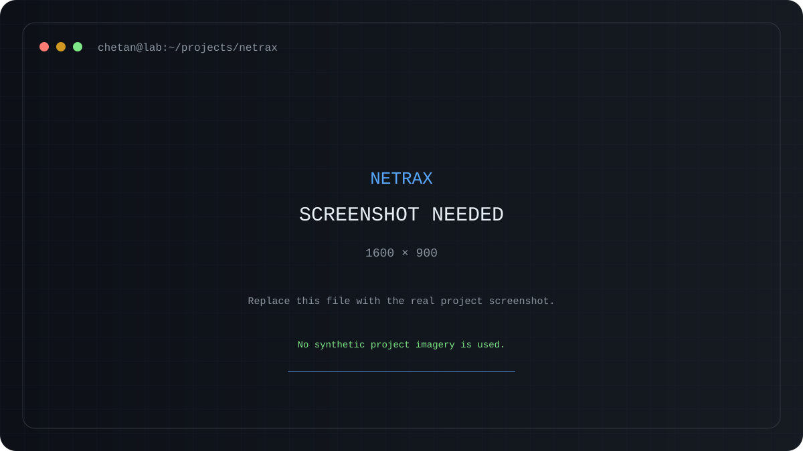
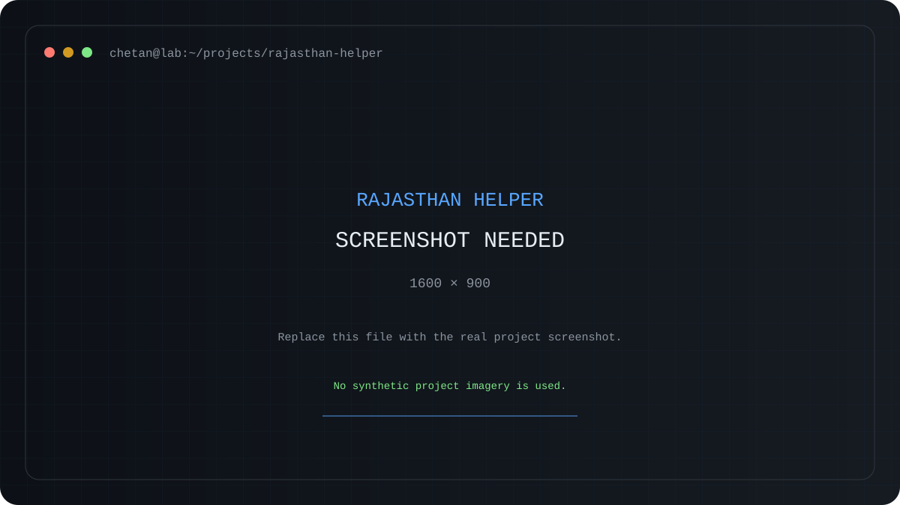
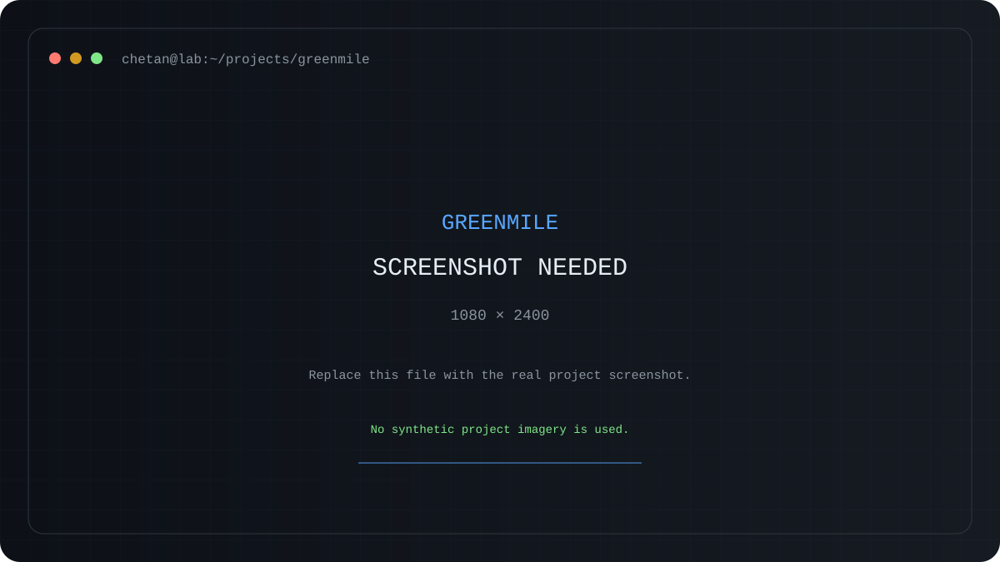
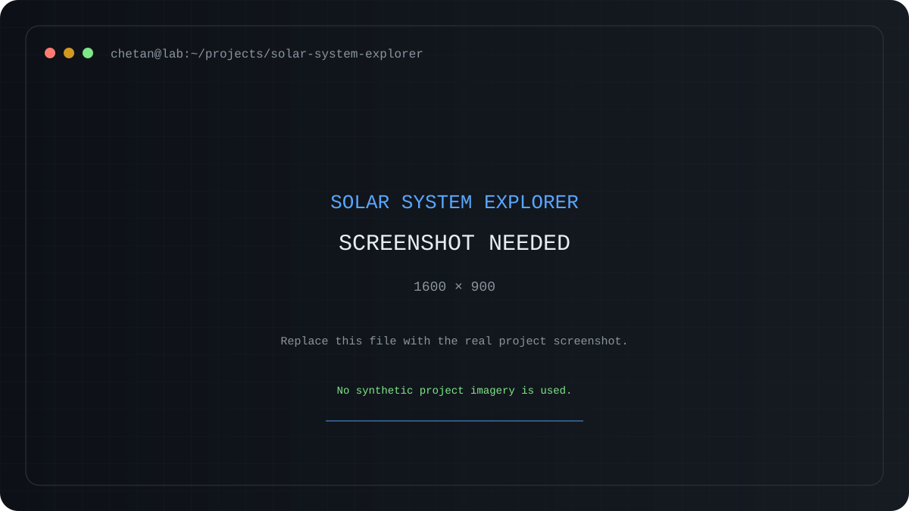
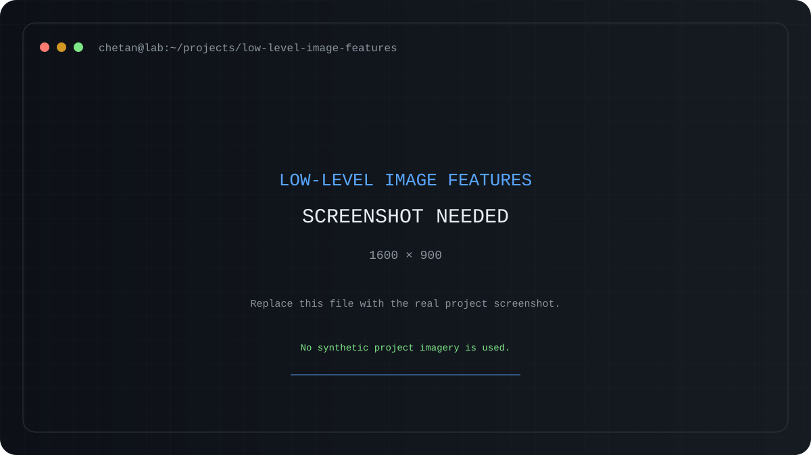

  <picture>
    <source media="(prefers-color-scheme: dark)" srcset="https://capsule-render.vercel.app/api?type=waving&color=0:0D1117,100:1F6FEB&height=220&section=header&text=Chetan%27s%20Engineering%20Lab&fontSize=38&fontAlignY=34&desc=AI%2FML%20%C2%B7%20GenAI%20%C2%B7%20Agents%20%C2%B7%20Computer%20Vision%20%C2%B7%20Software%20Engineering&descAlignY=56&descSize=16&animation=twinkling&fontColor=FFFFFF">
    <source media="(prefers-color-scheme: light)" srcset="https://capsule-render.vercel.app/api?type=waving&color=0:F6F8FA,100:DDF4FF&height=220&section=header&text=Chetan%27s%20Engineering%20Lab&fontSize=38&fontAlignY=34&desc=AI%2FML%20%C2%B7%20GenAI%20%C2%B7%20Agents%20%C2%B7%20Computer%20Vision%20%C2%B7%20Software%20Engineering&descAlignY=56&descSize=16&animation=twinkling&fontColor=111827">
    
  </picture>

  <picture>
    <source media="(prefers-color-scheme: dark)" srcset="https://readme-typing-svg.demolab.com/?font=JetBrains+Mono&size=20&duration=2800&pause=900&color=58A6FF&center=true&vCenter=true&width=860&lines=Building+AI%2FML+applications+that+actually+run;Experimenting+with+GenAI%2C+retrieval+%26+agents;Exploring+computer+vision%2C+security+%26+software;Build+%E2%86%92+test+%E2%86%92+understand+%E2%86%92+improve">
    <source media="(prefers-color-scheme: light)" srcset="https://readme-typing-svg.demolab.com/?font=JetBrains+Mono&size=20&duration=2800&pause=900&color=1F6FEB&center=true&vCenter=true&width=860&lines=Building+AI%2FML+applications+that+actually+run;Experimenting+with+GenAI%2C+retrieval+%26+agents;Exploring+computer+vision%2C+security+%26+software;Build+%E2%86%92+test+%E2%86%92+understand+%E2%86%92+improve">
    
  </picture>

  
  
  

---

## 👋 About

Computer Science & Engineering (AI/ML) student who learns by turning questions into working software.  
Working across AI/ML, GenAI and retrieval, agents, computer vision, cybersecurity, APIs, web and Android applications.  
Reach me through **[LinkedIn](https://www.linkedin.com/in/chetan-inaganti-563a41322/)** or **[my portfolio](https://chetan-code-lrca.github.io/Portfolio/)**.

  <strong>🏆 GitHub achievements · Pull Shark · Quickdraw · YOLO</strong>

---

## 🚀 Featured Projects

### 🛡️ NetraX

Passive cyber-threat analysis for strictly one-way traffic, combining flow features, threat detectors, and evidence-aware separability.

**Python · FastAPI · scikit-learn · React · Vite**  
→ [Open repository](https://github.com/Chetan-code-lrca/NetraX)

### 🧭 Rajasthan Helper

A small Python CLI for city weather, month-based festival lookup, and travel tips for supported Indian cities.

**Python · Click · Rich · Requests**  
→ [Open repository](https://github.com/Chetan-code-lrca/rajasthan-helper)

### 🌱 GreenMile

Android app for recording everyday sustainability activities and turning them into points, streaks, and leaderboard progress.

**Kotlin · Jetpack Compose · Firebase Authentication · Cloud Firestore**  
→ [Open repository](https://github.com/Chetan-code-lrca/GreenMile-SPSU-2026)

### 🌌 Interactive Solar System Explorer

Interactive React visualization with animated planetary orbits, playback controls, speed controls, and planet detail views.

**React · TypeScript · Vite · Tailwind CSS · Framer Motion**  
→ [Open repository](https://github.com/Chetan-code-lrca/solar_exp)

### 👁️ Low-Level Image Feature Extraction

Digital Image Processing project that extracts colour, texture, and shape information and combines it into a feature vector.

**Python · OpenCV · NumPy · Matplotlib · Pytest**  
→ [Open repository](https://github.com/Chetan-code-lrca/low-level-image-feature-extraction)

### 👕 FitMatch AI

Next.js wardrobe application with image uploads, outfit scoring, Outfit of the Day, and a rule-based stylist chat.

**Next.js · TypeScript · React · OpenAI**  
→ [Open repository](https://github.com/Chetan-code-lrca/Fit-Match_AI)

---

## 🧰 Tech Stack

### Languages

<picture>
  <source media="(prefers-color-scheme: dark)" srcset="https://skillicons.dev/icons?i=python,cpp,kotlin,ts,js,bash&theme=dark&perline=6">
  <source media="(prefers-color-scheme: light)" srcset="https://skillicons.dev/icons?i=python,cpp,kotlin,ts,js,bash&theme=light&perline=6">
  
</picture>

### Applications & Infrastructure

<picture>
  <source media="(prefers-color-scheme: dark)" srcset="https://skillicons.dev/icons?i=react,nextjs,fastapi,docker,git,github&theme=dark&perline=6">
  <source media="(prefers-color-scheme: light)" srcset="https://skillicons.dev/icons?i=react,nextjs,fastapi,docker,git,github&theme=light&perline=6">
  
</picture>

### AI, Cloud & Vision

<picture>
  <source media="(prefers-color-scheme: dark)" srcset="https://skillicons.dev/icons?i=azure,firebase,opencv,sklearn,pytorch&theme=dark&perline=5">
  <source media="(prefers-color-scheme: light)" srcset="https://skillicons.dev/icons?i=azure,firebase,opencv,sklearn,pytorch&theme=light&perline=5">
  
</picture>

  Ollama · FAISS · Gemini · OpenAI · GitHub Actions

---

## 🐍 Contributions

  <picture>
    <source media="(prefers-color-scheme: dark)" srcset="./profile/github-snake-dark.svg">
    <source media="(prefers-color-scheme: light)" srcset="./profile/github-snake.svg">
    
  </picture>

---

## 🤝 Connect

  
  

  <picture>
    <source media="(prefers-color-scheme: dark)" srcset="https://capsule-render.vercel.app/api?type=waving&color=0:1F6FEB,100:0D1117&height=100&section=footer&animation=twinkling">
    <source media="(prefers-color-scheme: light)" srcset="https://capsule-render.vercel.app/api?type=waving&color=0:DDF4FF,100:F6F8FA&height=100&section=footer&animation=twinkling">
    
  </picture>

